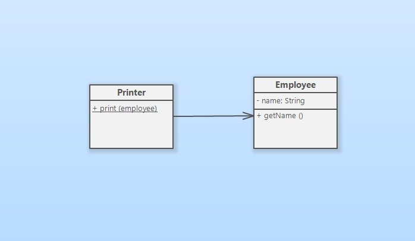
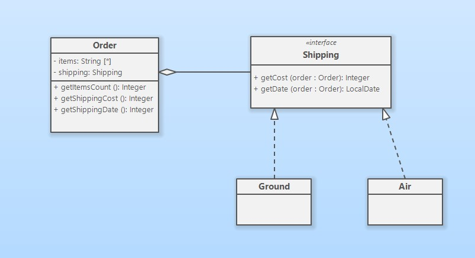
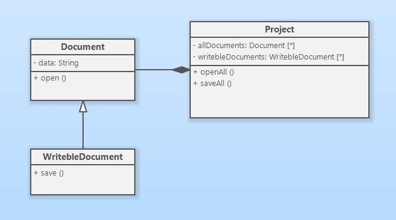
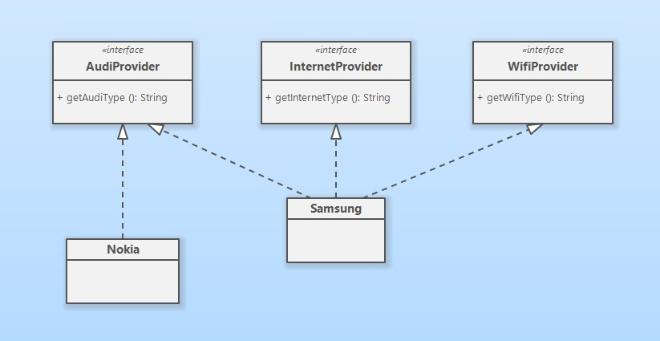
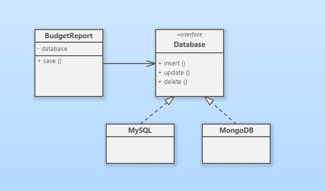

## Ч**то такое SOLID?**

SOLID – это аббревиатура из пяти основных принципов объектно-ориентированного программирования, 

изложенных Робертом Мартином в книге - 
**“Agile Software Development,
Principles, Patterns, and Practices”**.

## **Single Responsibility Principle**
_(принцип единой ответственности)_

Каждый класс должен иметь одну причину для изменений.

## **Open/Closed Principle**
_(принцип открытости/закрытости)_

Программные объекты должны быть открыты для расширения, 
но закрыты для модификации.

## **Liskov Substitution Principle**
_(принцип подстановки Лисков)_

Подклассы должны дополнять, а не замещать поведение 
базового класса.

## **Interface Segregation Principle**
_(принцип разделения интерфейса)_

Много интерфейсов, специально предназначенных для клиентов, 
лучше, чем один интерфейс общего назначения.

## **Dependency Inversion Principle**
_(принцип инверсии зависимостей)_

Зависимость на Абстракциях. Нет зависимости на что-то конкретное.

